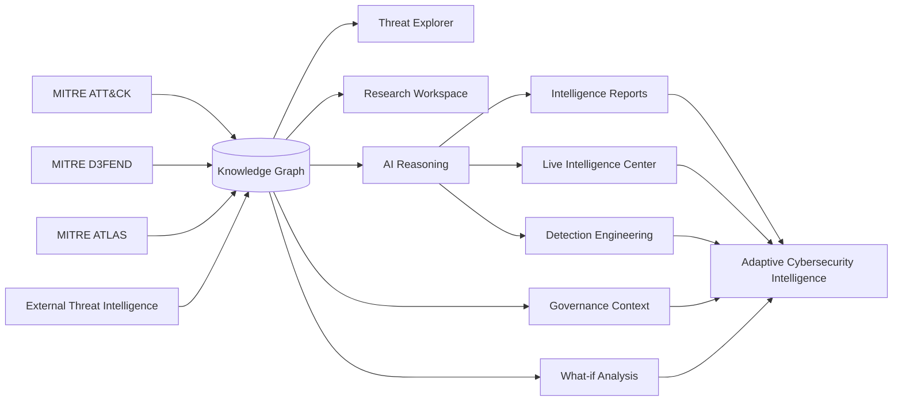
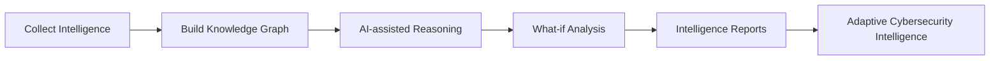
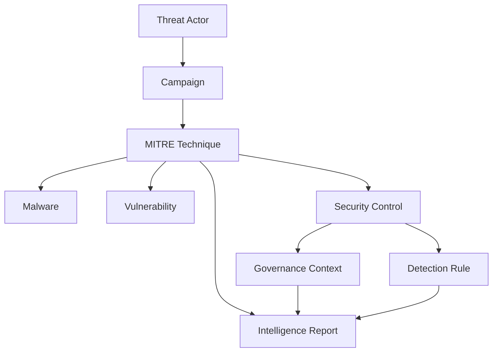
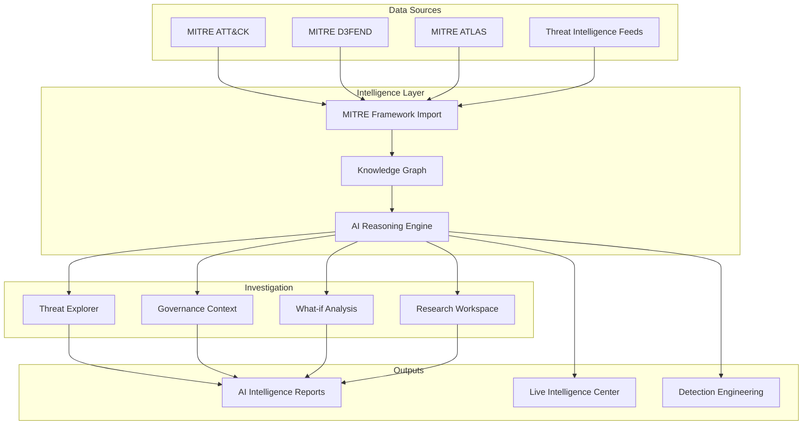
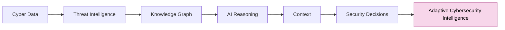

# OrchiCyb AI ATTACK 🌸 

## Overview

OrchiCyb AI ATTACK is an experimental AI-native Adaptive Cybersecurity Intelligence (ACI) platform designed to help to understand cyber threats through relationships rather than isolated data. Instead of treating MITRE ATT&CK techniques, threat actors, vulnerabilities and security frameworks as separate entities, the platform connects them into a single knowledge graph enriched with AI-assisted reasoning, governance context and interactive security simulations. The project explores how artificial intelligence can support cyber threat intelligence by explaining relationships between attacks, security controls, governance frameworks and organizational risk - not simply displaying more information.

The project explores the concept of **Adaptive Cybersecurity Intelligence (ACI)** - an approach where cyber defense continuously evolves through contextual intelligence and AI-assisted decision making.

---

### Try the latest version: 

**https://orchicyb-ai-attack.lovable.app**

---

## Supported Frameworks

- MITRE ATT&CK®
- MITRE D3FEND™
- MITRE ATLAS™
- NIST Cybersecurity Framework
- ISO/IEC 27001
- NIST AI RMF
- DORA

---

## Features

- AI-assisted Cyber Threat Intelligence
- Interactive Knowledge Graph
- MITRE ATT&CK, MITRE ATLAS & MITRE D3FEND integration
- What-if Analysis simulator
- Governance Context
- Live Intelligence Center
- AI-generated intelligence reports
- Research Workspace
- Detection Engineering
- Natural language investigation
- AI recommendations
- Threat relationship visualization

---

## Adaptive Cybersecurity Intelligence Pipeline

---

## What-if Analysis

The What-if Analysis module allows analysts to simulate how different security controls influence cyber risk. Instead of providing static recommendations, users can enable or disable controls such as MFA, EDR, SIEM or Network Segmentation and immediately observe how they affect likelihood, residual risk, governance exposure and defensive coverage. The objective is to help analysts understand the operational impact of security decisions before implementing them.

## Governance Context

Governance Context extends traditional ATT&CK mappings by explaining the relationship between cyber threats, security controls and governance requirements.

Rather than simply listing that a technique maps to ISO 27001, NIST CSF or DORA, the platform attempts to explain:
- why a specific threat makes certain controls important,
- how those controls contribute to reducing organizational risk,
- how governance frameworks relate to defensive strategies.

The goal is to bridge Cyber Threat Intelligence with governance through contextual explanations instead of static compliance mappings.

## Live Intelligence Center

The Threat Intelligence Dashboard serves as the operational entry point to the OrchiCyb AI ATTACK platform, providing a centralized overview of the current cyber threat landscape. Rather than displaying isolated metrics, the dashboard aggregates intelligence from the underlying knowledge graph and presents it as actionable operational awareness.

The Live Intelligence Center aggregates multiple intelligence sources into a single operational workspace.
Current capabilities include:
- CISA Known Exploited Vulnerabilities (KEV)
- AI-generated intelligence briefings
- Weak Signal monitoring
- Emerging threat overview

The objective is to combine structured threat intelligence with continuously updated situational awareness.

## Research Workspace

The Research Workspace provides an environment for exploring intelligence, organizing investigations and generating AI-assisted reports. Instead of acting as a document repository, the workspace supports an intelligence-driven workflow where analysts can move naturally between graph exploration, threat analysis and report generation.

## Knowledge Graph

The Knowledge Graph is the intelligence core of OrchiCyb AI ATTACK. Instead of representing cyber threat intelligence as isolated records, the platform models relationships between MITRE ATT&CK techniques, threat actors, malware, campaigns, vulnerabilities, security controls, governance frameworks and defensive technologies within a single interconnected graph. Analysts can visually explore attack paths, discover hidden relationships and understand how different entities influence one another across the cyber threat landscape. The graph is also designed to support AI-assisted reasoning, allowing the platform to explain why entities are connected, identify potential investigation paths and provide contextual intelligence instead of isolated indicators.

## Threat Explorer

The Threat Explorer provides a unified workspace for investigating cyber threats through contextual relationships rather than individual records. Each entity—including ATT&CK techniques, threat actors, malware, campaigns, vulnerabilities, mitigations and security controls—contains rich contextual information connected directly to the underlying knowledge graph. Beyond traditional threat intelligence, the explorer introduces Governance Context, helping analysts understand how specific threats relate to security controls, governance frameworks and organizational risk. Instead of simply listing mappings, the platform explains why particular controls matter, how they reduce exposure and how governance requirements support defensive strategies

## Intelligence Reports

The Intelligence Reports module transforms investigation results into structured, AI-assisted intelligence reports. Rather than exporting raw data, the platform generates reports that summarize cyber threats, explain relationships between entities, highlight governance considerations and provide actionable recommendations for security teams. Reports can include attack techniques, threat actor profiles, security controls, governance context, AI-generated observations and visual knowledge graph snapshots, making them suitable for research, threat intelligence sharing and executive briefings. The goal is to reduce manual reporting while improving consistency, explainability and decision support throughout the investigation process.

## Detection Engineering

The Detection Engineering module assists defenders in creating production-ready detection logic directly mapped to the MITRE ATT&CK framework. Rather than generating simple code snippets, the platform produces complete detection documentation that includes detection purpose, ATT&CK mappings, telemetry requirements, expected false positives, implementation considerations, and detection limitations. Users can generate detections across multiple technologies, including Sigma, YARA, Microsoft Sentinel KQL, Splunk SPL, Elastic DSL, CrowdStrike, Microsoft Defender XDR, Suricata, Snort, Falco, Sysmon, and OSQuery. Additional contextual information can be provided to tailor generated detections to specific environments or organizational requirements. By combining AI reasoning with cybersecurity best practices, the module accelerates detection development while promoting consistency, maintainability, and framework-aligned detection engineering workflows.

## Cyber Insights

Cyber Insights transforms raw relationships within the intelligence graph into contextual intelligence that helps analysts understand the broader security picture. Instead of requiring users to manually interpret thousands of graph connections, the platform continuously analyzes entity relationships and generates human-readable observations describing correlations, attacker behavior, mitigation opportunities, exposure risks, coverage gaps, and emerging trends. Each generated insight links directly back to the knowledge graph, allowing analysts to investigate the underlying evidence supporting every recommendation. This creates a transparent AI-assisted investigation workflow where conclusions remain explainable and traceable to their original intelligence sources. The goal of Cyber Insights is to reduce cognitive overload by automatically surfacing meaningful information that would otherwise remain hidden within complex interconnected cybersecurity datasets.

## Graph Analytics

Graph Analytics provides quantitative insights into the overall structure and health of the cybersecurity knowledge graph. Rather than focusing solely on threats, this module measures how intelligence itself is connected, enabling analysts to identify highly referenced techniques, influential threat actors, relationship density, and areas where intelligence coverage may be incomplete.

Structural metrics help security teams evaluate the completeness of their intelligence model while revealing which entities serve as central nodes within the threat ecosystem. Highly connected techniques often indicate frequently abused attacker behaviors and may deserve increased detection coverage or prioritization during threat hunting activities.

These analytics provide a complementary perspective to traditional dashboards by measuring the intelligence model itself instead of only operational security events.

## MITRE ATT&CK Import

The MITRE Framework Import module enables organizations to import multiple MITRE knowledge bases directly into the OrchiCyb knowledge graph.

Currently, the platform supports importing:
- MITRE ATT&CK® – adversary tactics, techniques, software, groups, mitigations and data sources
- MITRE D3FEND™ – defensive techniques and countermeasures
- MITRE ATLAS™ – adversarial AI tactics and techniques

During the import process, each framework is transformed into interconnected graph entities while preserving their original relationships. This creates a unified cybersecurity knowledge graph where offensive techniques, defensive controls and AI-specific attack patterns can be explored together instead of remaining isolated within separate frameworks. By combining multiple MITRE frameworks into a single intelligence model, OrchiCyb enables richer relationship analysis, AI-assisted reasoning and contextual investigations that span both traditional cybersecurity and emerging AI security threats.

## OrchiCyb AI Copilot

OrchiCyb AI Copilot is an AI-native cybersecurity assistant designed to reason over the complete intelligence graph rather than isolated documents. Leveraging relationships between MITRE ATT&CK techniques, threat actors, malware, campaigns, vulnerabilities, and defensive controls, the Copilot can answer complex cybersecurity questions using contextual knowledge rather than keyword matching. Analysts can request attack chain generation, explain adversary behavior, identify detection opportunities, recommend mitigations, generate investigation plans, and summarize complex threat intelligence directly within the platform. Every response is grounded in the underlying graph model, allowing AI to produce recommendations that reflect the relationships between entities instead of treating each object independently. The long-term vision of the Copilot is to become an intelligent cyber operations assistant capable of supporting Security Operations Centers, Threat Hunters, Detection Engineers, Incident Responders, and Cyber Threat Intelligence analysts throughout every stage of the defensive workflow.

---

## Technology

OrchiCyb AI ATTACK combines modern cybersecurity concepts with AI-native intelligence workflows, including:

- Artificial Intelligence (AI)
- Adaptive Cybersecurity Intelligence (ACI)
- Cyber Threat Intelligence (CTI)
- Knowledge Graphs
- MITRE ATT&CK®
- MITRE D3FEND™
- MITRE ATLAS™
- Detection Engineering
- Threat Hunting
- Governance Context
- AI-assisted Security Reasoning
- Interactive Threat Visualization
- Live Threat Intelligence
- Modern UX for Security Operations

  

---

## Vision

The long-term vision of OrchiCyb AI ATTACK is to explore how Adaptive Cybersecurity Intelligence can transform cyber defense.
Rather than building another threat intelligence platform, the project investigates how AI, knowledge graphs and contextual reasoning can help security professionals understand relationships between cyber threats, security controls, governance frameworks and organizational risk. The goal is to make cyber intelligence more explainable, interconnected and actionable.

---

## Disclaimer

OrchiCyb AI ATTACK is an independent research project intended for educational, research, and cybersecurity innovation purposes.
MITRE ATT&CK® is a registered trademark of The MITRE Corporation.

---

## License
Copyright (c) 2026 OrchiCyb Dominika Jakubek

All rights reserved.
This repository contains documentation and public information about the project.
No part of this repository may be copied, modified, distributed, or used to create derivative works without prior written permission from the copyright holder.
